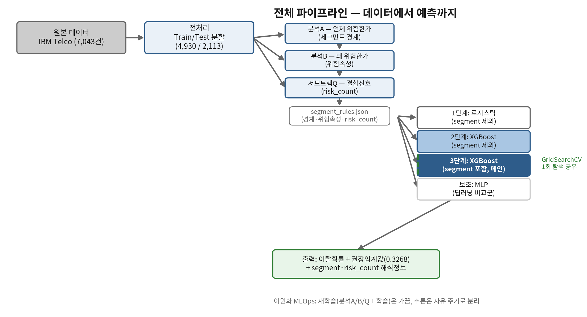
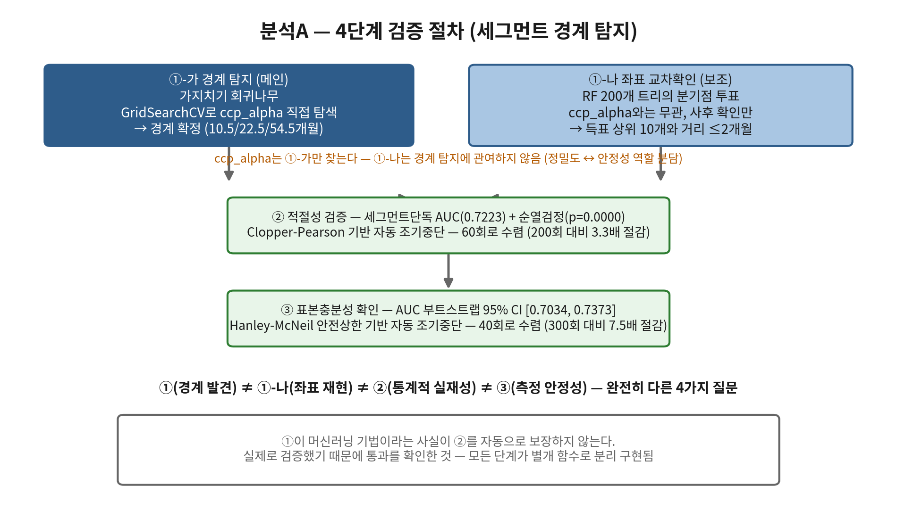
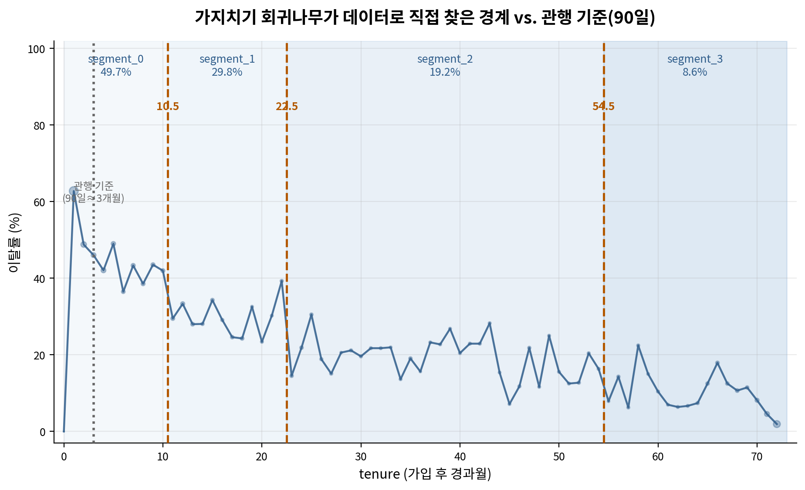
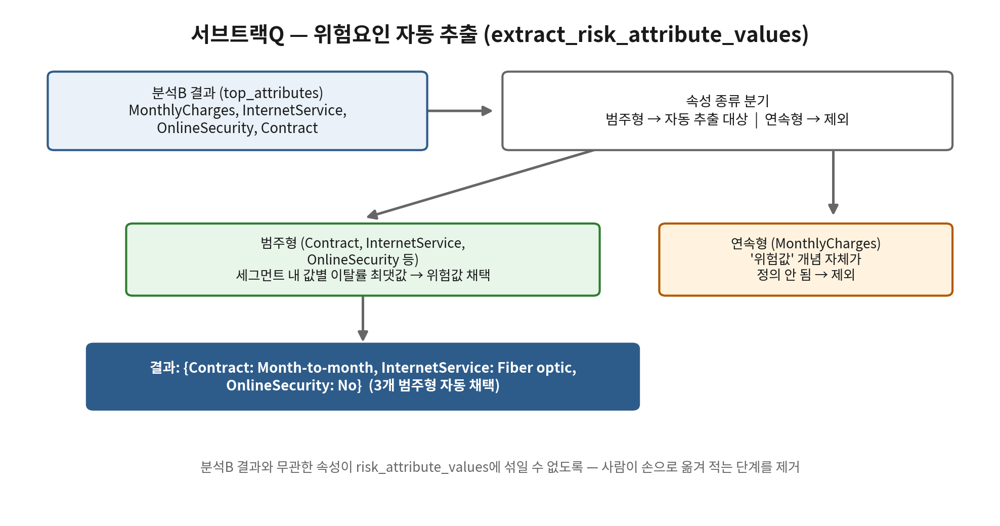
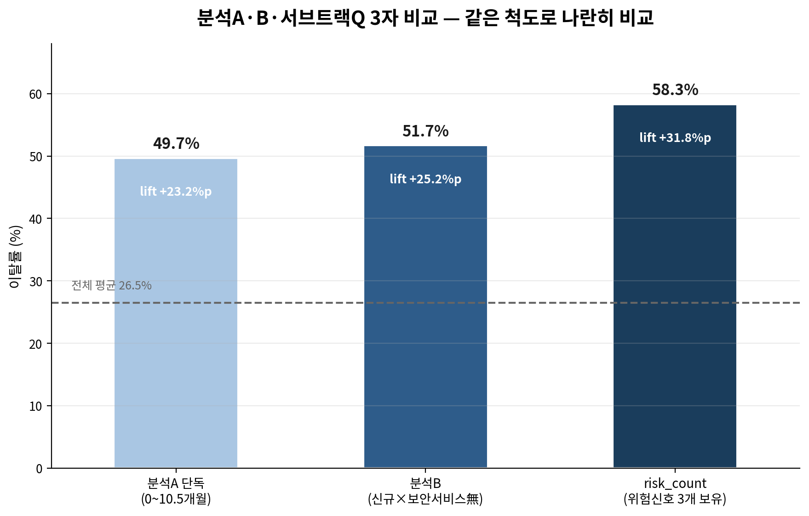
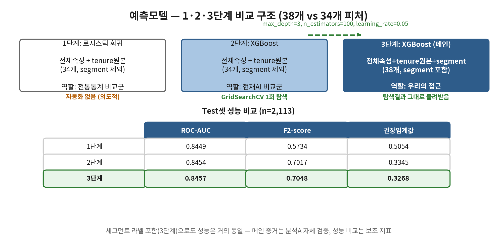
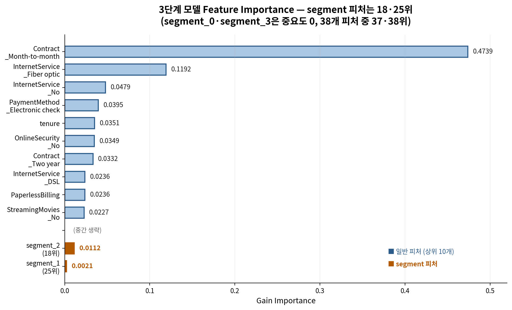
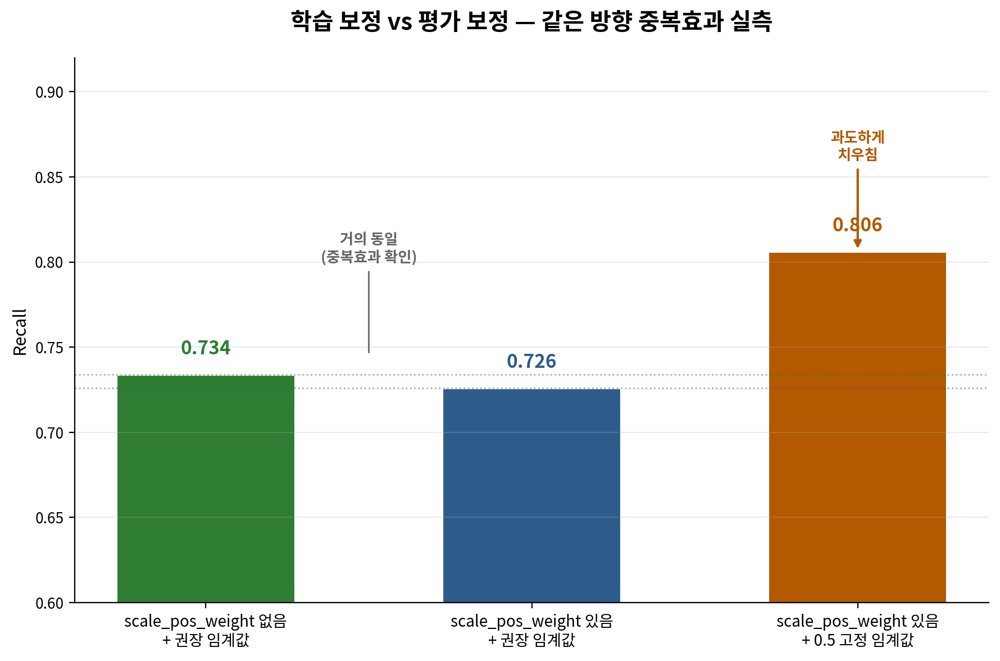
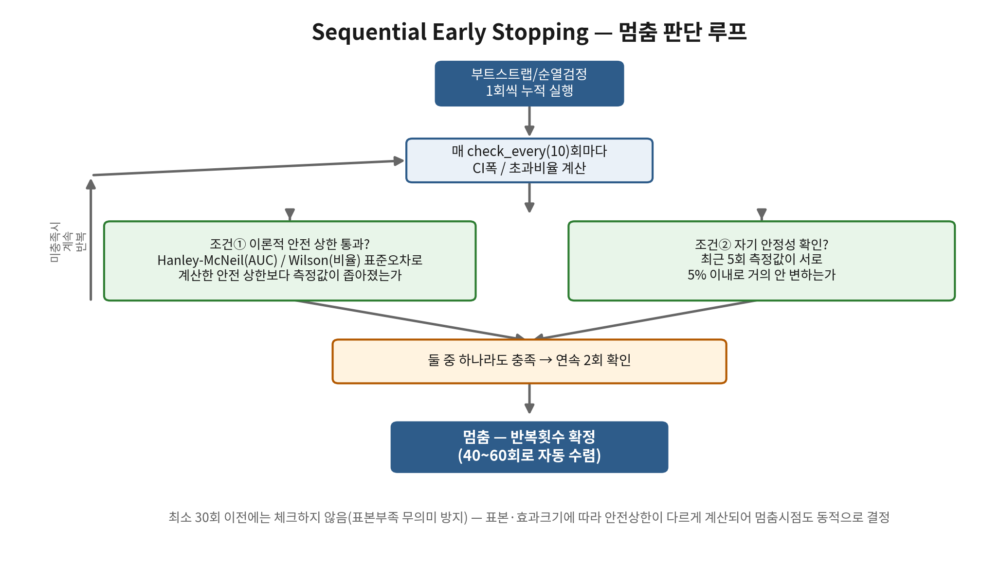
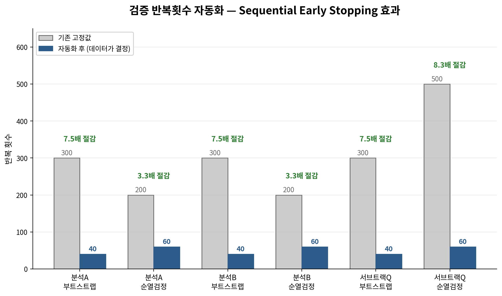

# Customerang — 고객 이탈 예측 시스템

> 순열·부트스트랩 자동화 루프로 검증된 생애주기 세그먼트·위험속성·위험신호 분석 체계와 이원화 MLOps 아키텍처를 결합한 고객 이탈 예측 시스템

본 README는 다음 세 가지 제출 문서의 내용을 그대로 옮겨 담았다. 요약·재구성 없이 각 결과서의 표·수치·서술을 원문 그대로 포함하며, 모든 수치는 실행 ID `20260622_171419`의 단일 실행으로부터 재현 가능하다.

- **01. 인공지능 데이터 전처리 결과서**
- **02. 인공지능 학습 결과서**
- **03. 모델 설계도**

---

## 목차

- [팀 소개 및 역할 분담](#팀-소개-및-역할-분담)
- [폴더 구조](#폴더-구조)
- [핵심 설계 원칙](#핵심-설계-원칙)
- [실행 순서](#실행-순서)
- [테스트 / 설정 / 자동화](#테스트--설정--자동화)
- [기술 스택](#기술-스택)
- [01. 인공지능 데이터 전처리 결과서](#01-인공지능-데이터-전처리-결과서)
- [02. 인공지능 학습 결과서](#02-인공지능-학습-결과서)
- [03. 모델 설계도](#03-모델-설계도)

---

## 팀 소개 및 역할 분담

**Customerang**

| 구성원 | 역할 |
|---|---|
| 오한빈 (팀장) | 핵심 아이디어 제안(생애주기 세그멘테이션의 데이터 기반 자동화 루프화), 분석A·분석B·서브트랙Q·예측모델 전체 기획·설계·파이프라인 구축 및 검증 구현, 전처리 구현, 프로젝트 전 과정 참여 |
| 서유현, 소성민, 임정택 | 팀장이 설계한 분석A·분석B·서브트랙Q·예측모델 전 영역에 걸쳐 공동으로 실데이터 검증 수행, Streamlit 대시보드 구현 |

---

## 폴더 구조

```
Customerang/  (저장소명: SKN32-2nd-4Team)
├── config.py             # 전체 프로젝트 설정 단일 출처 (랜덤시드, 반복횟수, 하이퍼파라미터, 경로)
├── .github/workflows/
│   └── tests.yml          # push/PR마다 자동으로 tests/ 실행 (CI)
├── docs/diagrams/         # 03. 모델 설계도 다이어그램 원본 (PNG)
├── tests/                 # pytest — 회귀 테스트
├── logs/                  # train.py 실행 기록 (성공/실패 모두, .gitignore 대상)
│
├── segment_discovery/   # 분석A·분석B·서브트랙Q (재학습 묶음 — train.py와 같은 주기로 가끔 실행)
│   ├── src/
│   │   ├── preprocessing.py    # 탐색용 전처리 (원본 로드~Train/Test 분할)
│   │   ├── analysis_a.py       # ①-가 가지치기회귀나무 ①-나 RF보조검증 ②AUC+순열검정 ③부트스트랩CI
│   │   ├── analysis_b.py       # Ⓐ패턴탐지 Ⓑ적절성검증(AUC+순열검정) Ⓒ부트스트랩CI + extract_risk_attribute_values
│   │   ├── subtrack_q.py       # risk_count(메인) + K-means(보조탐색)
│   │   └── gap_calibration.py  # Sequential Early Stopping 공통 루프 + structural_gap 적응형 보정
│   ├── outputs/
│   │   └── segment_rules.json  # ← churn_prediction이 읽는 유일한 인터페이스
│   └── app.py                  # 진입점
│
├── churn_prediction/     # 예측모델
│   ├── src/
│   │   ├── feature_engineering.py  # segment_rules.json 적용, FeatureTransformer(저장/로드 가능)
│   │   ├── train_models.py         # 1단계 로지스틱회귀 / 2·3단계 XGBoost(GridSearchCV) / 보조 MLP
│   │   └── evaluate.py             # 평가지표, 임계값, FN비용 추정, SHAP/Feature Importance 교차검증
│   ├── outputs/
│   │   ├── versions/{timestamp}/   # 재학습할 때마다 새 폴더 (model.pkl, feature_transformer.pkl, metadata.json 등)
│   │   ├── latest/                  # versions/ 중 가장 최근 버전의 복사본 — predict.py가 항상 여기만 봄
│   │   └── run_history.csv          # 실행마다 한 줄씩 누적 (언제, 어떤 데이터로, 성능이 어땠는지)
│   ├── train.py        # 재학습 묶음 — segment_discovery와 같은 주기 (가끔, 표본 충분히 쌓였을 때)
│   └── predict.py      # 추론 — 학습 없음, 독립적으로 자유로운 주기 (언제든 즉시)
│
├── webapp/               # Streamlit 대시보드
│   ├── app.py             # 진입점 (streamlit run webapp/app.py)
│   ├── lib/
│   │   ├── data.py         # segment_rules.json·outputs/latest·원본 CSV 로딩 공통 모듈
│   │   └── theme.py        # 대시보드 공통 테마/스타일
│   └── views/
│       ├── overview.py     # 홈/개요 — KPI, 요인 TOP5, 확률분포, tenure 추이
│       ├── priority.py     # 우선 대응 고객 — 예상 손실(월요금×이탈확률) 기준 재무지표 분해
│       ├── analysis.py, analysis_a.py, analysis_b.py, subtrack_q.py  # 분석A/B/서브트랙Q 결과 시각화
│       ├── roi.py          # 이탈 방어 비용 효과 분석 — 혜택 비용 대비 기대 매출 유지액 비교
│       └── whatif.py       # 위험 고객 맞춤 프로모션 시뮬레이터 — 속성 변경 시 이탈확률 변화
│
├── shared/                # 두 패키지 공통 모듈
│   ├── columns.py          # CATEGORICAL_COLS 등 컬럼 분류의 단일 출처
│   ├── data_loader.py      # clean_raw_data: 자료형 정리+No-service 통합 공통 관문
│   ├── stats_formulas.py   # Hanley-McNeil/Wilson 표준오차 — 순환 import 해소를 위해 분리된 공통 모듈
│   └── logging_setup.py    # train.py 등의 실패 추적용 파일 로깅
├── data/                  # 원본 데이터 (WA_FnUseC_TelcoCustomerChurn.csv), 신규고객은 new_customers.csv
└── requirements.txt        # 검증된 최소 버전 명시
```


## 핵심 설계 원칙

- **이원화의 진짜 경계선은 "재학습 vs 추론"이다 — "분석 vs 예측"이 아니다**
  - **재학습 묶음(가끔, 표본이 충분히 쌓였을 때만 함께 실행)**: `segment_discovery`(세그먼트 경계·위험속성 발견)와 `churn_prediction/train.py`(모델 학습)는 같은 주기를 따른다. `train.py`가 쓰는 `segment_rules.json` 자체가 `segment_discovery`의 산출물이므로, 분석A/B/Q가 갱신될 때 모델도 같은 누적 데이터로 함께 재학습하는 게 일관적이다. 표본부족 위험(범주가 통째로 빠지는 등) 때문에 "신규 데이터만"으로 재학습하지 않고 항상 누적 전체 데이터로 학습한다.
  - **추론(`churn_prediction/predict.py`, 자유 주기)**: 학습 과정이 전혀 없으므로(`outputs/latest/model.pkl`을 그대로 불러와 `predict_proba`만 호출) 데이터 양·시점과 무관하게 항상 안정적으로 동작한다. 정해진 주기 없이 필요할 때마다(매일, 즉석 조회, 특정 구간만 골라보기 등) 자유롭게 실행 가능 — "최신성을 반영한다"는 역할은 재학습이 아니라 이 추론 단계가 담당한다.
- **재학습 결과는 덮어쓰지 않고 버전별로 보관한다**: `train.py`를 실행할 때마다 `outputs/versions/{실행시각}/`에 그 버전의 모델·변환규칙·평가결과·메타데이터(데이터 경로, 행 수, 성능)가 통째로 보관되고, 그중 최신 버전만 `outputs/latest/`로 복사된다. `predict.py`는 `outputs/latest/`만 보므로 항상 가장 최근 모델을 쓰며, 과거 버전이 필요하면 `outputs/versions/`에서 직접 꺼내 비교할 수 있다. `outputs/run_history.csv`에는 실행마다 한 줄씩(시각·데이터 경로·성능 요약) 누적되어 "언제 누가 재학습했는지" 추적 가능하다.
- **인터페이스는 코드가 아니라 결과 파일**: `churn_prediction`은 `segment_discovery`의 내부 함수를 import하지 않고, `segment_rules.json`(경계, 위험속성, risk_count 계산식)만 읽는다. `predict.py`도 `train.py`의 코드를 다시 실행하지 않고, `train.py`가 저장해둔 결과(`outputs/latest/`)만 읽는다. Streamlit 대시보드(`webapp/`) 역시 `segment_rules.json`과 `outputs/latest/`를 읽기만 할 뿐, 다른 패키지의 내부 함수를 직접 호출하지 않는다.
- **FeatureTransformer로 "학습 때 fit한 규칙"을 고정**: 더미컬럼 목록과 StandardScaler를 `train.py`가 fit해서 `feature_transformer.pkl`로 저장해두면, `predict.py`는 그 규칙을 그대로 재사용해 새 데이터를 변환한다. 추론 시 새로 fit하지 않으므로, 학습 때와 다른 인코딩이 생기는 일이 없다.
- **"범위를 나눠 본다"는 건 날짜가 아니라 tenure(경과월) 기준이다**: 이 데이터는 절대 가입일/수집일이 없는 스냅샷 데이터다. 그래서 "2026년 5월 가입자만" 같은 절대 시점 필터링은 할 수 없고, "tenure 0\~5개월 구간만", "특정 segment만"처럼 경과월 기준으로만 범위를 나눌 수 있다.
- **feature_cols_12 / feature_cols_3 분리**: "1단계는 세그먼트 라벨을 절대 포함하지 않는다"는 원칙이 코드에서 깨지지 않도록, 인코딩 직후 두 가지 피처 목록을 명시적으로 따로 구성한다.
- **분석A·B 모두 ②③(또는 Ⓑ Ⓒ) 검증을 통과해야 확정**: 가지치기/결정나무로 패턴을 찾는 것과, 그 패턴이 우연이 아님을 순열검정·부트스트랩으로 검증하는 것은 완전히 별개 절차다. 부트스트랩은 Out-of-Bag(OOB) 방식으로 구현되어 있다. 반복횟수는 고정값이 아니라 순차적 조기 중단(Sequential Early Stopping)으로 데이터가 직접 정한다.
- **멈춤 판단 로직은 한 곳에서 공통 관리**: 분석A·분석B·서브트랙Q 세 곳이 거의 동일한 부트스트랩 멈춤 판단 코드를 따로 구현하고 있던 것을 점검 중 발견 — `gap_calibration.run_sequential_bootstrap()`으로 공통화하였다.
- **위험요인은 분석B 결과에서 자동 추출**: 서브트랙Q의 위험속성·위험값 매핑은 사람이 직접 적지 않고 `extract_risk_attribute_values()`가 분석B의 `top_attributes`에서 범주형 속성만 추출해 자동으로 결정한다.


## 실행 순서

> ⚠️ 분석A의 ②③(순열검정·부트스트랩)은 반복 계산이 있어 환경에 따라 시간이 걸릴 수 있습니다. 둘 다 순차적 조기 중단으로 자동화되어 있어(부트스트랩은 수십 회, 순열검정은 약 60회) 예전(고정 300회·200회)보다 체감 속도가 훨씬 빠릅니다.

**VSCode에서 버튼으로 실행**: `app.py`, `train.py`, `predict.py` 모두 기본 경로가 코드에 들어가 있어, 명령줄 인자 없이 파일을 열고 우측 상단 ▶(Run Python File) 버튼만 눌러도 그대로 실행됩니다.

**터미널에서 인자를 직접 지정하고 싶을 때**:

```bash
pip install -r requirements.txt

# 1. 세그먼트/위험속성/risk_count 발견 (표본이 충분히 쌓였을 때)
cd segment_discovery
python app.py --data ../data/WA_FnUseC_TelcoCustomerChurn.csv

# 2. 예측모델 재학습 (segment_rules.json 필요) — 실행마다 outputs/versions/{시각}/에 새로 쌓이고 outputs/latest/가 갱신됨
cd ../churn_prediction
python train.py --data ../data/WA_FnUseC_TelcoCustomerChurn.csv \
                --rules ../segment_discovery/outputs/segment_rules.json

# 3. 추론 (학습 없음, 언제든 원하는 만큼 자주 실행 가능) — outputs/latest/의 모델을 사용
python predict.py --data ../data/new_customers.csv

# 4. 대시보드
streamlit run ../webapp/app.py
```


## 테스트 / 설정 / 자동화

- **설정값은 `config.py` 한 곳에서 관리**: 랜덤시드, Train/Test 분할 비율, 순열검정·부트스트랩 반복횟수, XGBoost 하이퍼파라미터 등을 바꾸려면 이 파일만 고치면 된다.
- **테스트 실행**: `pip install -r requirements.txt` 후 `pytest tests/ -v`.
- **CI**: `.github/workflows/tests.yml`이 push/PR마다 GitHub Actions에서 자동으로 `pytest`를 돌린다.
- **실패 추적**: `train.py` 실행 결과(성공/실패)는 `logs/train.log`에 타임스탬프와 함께 누적된다.


---

## 기술 스택

| 구분 | 기술 |
|---|---|
| **언어** | Python 3.12 |
| **데이터 처리** | pandas ≥2.0, numpy ≥2.0 |
| **머신러닝** | scikit-learn ≥1.5 (DecisionTree, RandomForest, LogisticRegression, GridSearchCV), XGBoost ≥2.0 |
| **모델 해석** | SHAP ≥0.45 |
| **통계 비교군** | ruptures ≥1.1 (PELT 변화점 탐지), lifelines ≥0.27 (Kaplan-Meier) |
| **통계 기법** | Hanley-McNeil(AUC 표준오차), Wilson(비율 표준오차), Clopper-Pearson(이항분포 신뢰구간) — `shared/stats_formulas.py`, `segment_discovery/src/gap_calibration.py`에 직접 구현 |
| **모델 직렬화** | joblib ≥1.3 |
| **대시보드** | Streamlit ≥1.30, Altair (시각화) |
| **테스트** | pytest ≥8.0 (회귀 테스트) |
| **CI/CD** | GitHub Actions (`.github/workflows/tests.yml`) |
| **데이터셋** | IBM Telco Customer Churn (7,043건, 21개 컬럼) |

---

## 01. 인공지능 데이터 전처리 결과서

**인공지능 데이터 전처리 결과서**

가입 고객 이탈 예측 시스템

*IBM Telco Customer Churn Dataset 기반*

**Customerang**

팀장 오한빈

팀원 서유현 · 소성민 · 임정택

2026-06-22

1\. 개요

본 문서는 IBM Telco Customer Churn 데이터셋(7,043건, 21개 컬럼)을 분석 및 모델 학습에 적합한 형태로 가공한 전처리 과정과 그 결과를 정리한다. 전처리는 분석A(세그먼트 경계 탐지)·분석B(위험속성 탐지)·서브트랙Q(risk_count)와 예측모델 학습 전 단계에서 공통으로 수행되며, 모든 단계는 재현 가능한 코드(segment_discovery/src/preprocessing.py, shared/data_loader.py, churn_prediction/src/feature_engineering.py)로 구현되어 있다.

1.1 데이터셋 개요

|                |                                                            |
|----------------|------------------------------------------------------------|
| **항목**       | **값**                                                     |
| 데이터 출처    | IBM Telco Customer Churn (blastchar, Kaggle 공개 데이터셋) |
| 원본 레코드 수 | 7,043건                                                    |
| 원본 컬럼 수   | 21개 (식별자 1, 범주형 16, 수치형 3, 타깃 1)               |
| 타깃 변수      | Churn (이탈 여부, Yes/No)                                  |
| 원본 이탈률    | 1,869건 / 7,043건 = 26.5%                                  |

*표 1-1. 원본 데이터셋 개요*

1.2 전처리 파이프라인 구조

핵심 설계 원칙은 pandas DataFrame 하나(df)를 파이프라인 전체에서 유지하는 것이다. customerID 등 식별 컬럼을 위한 별도 자료구조를 두지 않고, 모델 입력(X)은 필요한 시점에 df에서 컬럼만 선택하여 구성한다. 예측 결과 역시 df에 새 컬럼으로 재결합하여 손해추정 등 후속 분석에 바로 활용할 수 있도록 한다.

*데이터 누수 방지 원칙: 세그먼트 경계, 더미 컬럼 목록, 스케일러의 fit은 전부 Train 데이터로만 수행하고 Test/추론 데이터에는 적용(transform)만 한다. 이 원칙은 segment_discovery/src/preprocessing.py와 churn_prediction/src/feature_engineering.py 양쪽에서 코드로 강제된다.*

2\. 결측치 및 데이터 정합성 처리

2.1 TotalCharges 결측치 처리

원본 데이터에서 TotalCharges 컬럼은 문자열(object) 타입으로 저장되어 있으며, 공백 문자열 형태의 결측치 11건이 존재한다. pd.to_numeric(errors='coerce')로 숫자형 변환 후 결측치를 0으로 대체하였다.

|                     |                                                        |
|---------------------|--------------------------------------------------------|
| **검증 항목**       | **결과**                                               |
| 결측치 건수         | 11건 (전체의 0.16%)                                    |
| 결측 행의 tenure 값 | 전부 0 (신규 가입 당일, 아직 청구 이력 없음)           |
| 결측 행의 Churn 값  | 전부 'No' (비이탈) — 11건 모두 일치                    |
| 대체 처리 방법      | 0으로 대체 (신규 가입자의 누적 청구액이 0인 것은 타당) |

*표 2-1. TotalCharges 결측치 검증 결과*

*결측치가 무작위가 아니라 tenure=0이라는 구조적 원인에서 발생했음을 확인하였으며, 단순 대체가 아니라 원인 추적 후 처리한 결과이다.*

2.2 중복 정보 통합 (다중공선성 방지)

'No internet service' 및 'No phone service' 값은 'No'로 통합하였다. 이는 단순한 정보 손실 방지 목적이 아니라, 해당 값이 InternetService_No / PhoneService_No 컬럼과 100% 중복되어 원-핫 인코딩 시 다중공선성을 유발하기 때문이다.

|                  |                                        |             |
|------------------|----------------------------------------|-------------|
| **대상 컬럼**    | **변환 전 'No internet service' 건수** | **변환 후** |
| OnlineSecurity   | 1,526건                                | 0건         |
| OnlineBackup     | 1,526건                                | 0건         |
| DeviceProtection | 1,526건                                | 0건         |
| TechSupport      | 1,526건                                | 0건         |
| StreamingTV      | 1,526건                                | 0건         |
| StreamingMovies  | 1,526건                                | 0건         |

*표 2-2. InternetService 관련 중복정보 통합 결과 (1,526명 = 전체의 21.7%)*

|               |                                     |             |
|---------------|-------------------------------------|-------------|
| **대상 컬럼** | **변환 전 'No phone service' 건수** | **변환 후** |
| MultipleLines | 682건                               | 0건         |

*표 2-3. PhoneService 관련 중복정보 통합 결과 (682명 = 전체의 9.7%)*

3\. Train/Test 분할

계층화 분할(stratify=Churn)을 적용하여 70:30 비율로 Train/Test를 분할하였다. 계층화 분할의 목적은 이탈 비율(26.5%)이 양쪽 데이터셋에 동일하게 유지되도록 하여, 분할로 인한 우연한 클래스 불균형 차이가 평가 결과를 왜곡하지 않도록 하는 것이다.

|          |                 |            |
|----------|-----------------|------------|
| **구분** | **레코드 수**   | **이탈률** |
| Train    | 4,930건 (70.0%) | 26.53%     |
| Test     | 2,113건 (30.0%) | 26.55%     |
| 전체     | 7,043건         | 26.54%     |

*표 3-1. Train/Test 분할 결과 (실행 ID: 20260622_171419 기준)*

*Train/Test 간 이탈률 차이가 0.02%p에 불과하여 계층화 분할이 정확히 작동함을 확인하였다.*

3.1 Train 데이터 주요 수치형 변수 분포

|                |          |              |            |            |            |
|----------------|----------|--------------|------------|------------|------------|
| **변수**       | **평균** | **표준편차** | **최솟값** | **중앙값** | **최댓값** |
| tenure (개월)  | 32.47    | 24.65        | 0          | 29         | 72         |
| MonthlyCharges | 64.95    | 30.24        | 18.40      | 70.58      | 118.75     |

*표 3-2. Train 데이터 수치형 변수 기술통계*

4\. 변수 인코딩

4.1 이진 범주형 변수

Partner, Dependents, PhoneService, PaperlessBilling 등 Yes/No 이진값을 갖는 컬럼은 .map({'Yes':1,'No':0})으로 단순 매핑하였다.

4.2 다중 범주형 변수 (원-핫 인코딩)

gender, MultipleLines, InternetService, OnlineSecurity, OnlineBackup, DeviceProtection, TechSupport, StreamingTV, StreamingMovies, Contract, PaymentMethod 등 다중 범주형 변수는 원-핫 인코딩을 적용하였다. 더미 컬럼 목록은 Train 데이터 기준으로만 생성(fit)하고, Test/추론 데이터에는 동일 목록을 강제 정렬(reindex)하여 적용한다.

|                                                   |        |
|---------------------------------------------------|--------|
| **항목**                                          | **값** |
| Train 기준 생성된 더미 컬럼 수                    | 42개   |
| feature_cols_12 (1·2단계 모델 입력, segment 제외) | 34개   |
| feature_cols_3 (3단계 모델 입력, segment 포함)    | 38개   |

*표 4-1. 인코딩 후 피처 구성*

*⚠️ 단계별 입력 피처가 다름: segment 컬럼은 분석A가 데이터 기반으로 발견한 결과물이므로, '사람이 정한 단순 함수형태'를 대표하는 1단계(로지스틱 회귀) 및 2단계(XGBoost 비교군) 입력에는 포함하지 않는다. 3단계(메인 모델) 입력에만 포함하여 분석A 발견의 기여도를 검증할 수 있도록 한다.*

4.3 세그먼트(segment) 컬럼 — 분석A 산출물의 인코딩

분석A(가지치기 회귀나무 기반 경계 탐지)가 데이터 기반으로 발견한 생애주기 구간 경계를 적용하여 segment 컬럼을 생성하고, Contract와 동일하게 다중 범주형으로 원-핫 인코딩하였다.

|              |                       |                  |            |
|--------------|-----------------------|------------------|------------|
| **세그먼트** | **tenure 구간(개월)** | **Train 표본수** | **이탈률** |
| segment_0    | 0 ~ 10.5              | 1,369건          | 49.67%     |
| segment_1    | 10.5 ~ 22.5           | 749건            | 29.77%     |
| segment_2    | 22.5 ~ 54.5           | 1,534건          | 19.23%     |
| segment_3    | 54.5 이상             | 1,278건          | 8.61%      |

*표 4-2. 세그먼트 경계 및 분포 (분석A 산출물, K=4)*

*경계값(10.5, 22.5, 54.5개월)은 가지치기 회귀나무를 통해 데이터가 직접 탐색하였으며, 세그먼트단독 AUC 0.7223(95% CI \[0.7034, 0.7373\])과 순열검정 p=0.0000으로 통계적 실재성이 검증되었다. 검증 절차의 상세 내용은 인공지능 학습 결과서를 참조한다.*

4.4 연속형 변수 스케일링

tenure, MonthlyCharges, TotalCharges는 모델 계열에 따라 두 가지 방식으로 처리한다.

- 트리 기반 모델(2·3단계 XGBoost): 원본 값을 그대로 사용 (트리 모델은 스케일에 불변)

- 선형/MLP 모델(1단계 로지스틱 회귀, 보조 MLP): StandardScaler를 Train 데이터로 fit하고 Test/추론 데이터에는 transform만 적용

5\. 전처리 검증 결과

5.1 데이터 누수 방지 검증

아래 항목에 대해 Train 데이터로만 규칙(rule)을 학습(fit)하고 Test/추론 데이터에는 적용(transform)만 한다는 원칙이 코드 수준에서 지켜지는지 자동 테스트로 검증하였다(tests/test_feature_transformer.py).

|                              |                                          |          |
|------------------------------|------------------------------------------|----------|
| **검증 항목**                | **검증 방법**                            | **결과** |
| 세그먼트 경계 fit            | Train으로만 탐색, Test는 적용만          | 통과     |
| 더미 컬럼 목록 fit           | Train 기준 컬럼만 dummy_columns에 포함   | 통과     |
| 스케일러 재학습 여부         | 추론 시 scaler.fit() 미호출 확인         | 통과     |
| 학습 시점 없던 범주값 처리   | reindex(fill_value=0)으로 안전 처리      | 통과     |
| tenure가 학습 최댓값 초과 시 | 마지막 세그먼트로 안전 분류 (NaN 미발생) | 통과     |

*표 5-1. 데이터 누수 방지 자동 검증 결과 (전체 88개 테스트 중 발췌)*

5.2 운영 환경 적용 — 학습/추론 일원화

전처리 규칙(더미 컬럼 목록, 스케일러 파라미터, 세그먼트 경계)은 FeatureTransformer 객체로 직렬화(feature_transformer.pkl)되어 저장된다. 추론 단계(predict.py)는 이 객체를 그대로 불러와 재사용하며, 별도로 규칙을 재학습하지 않는다. 이를 통해 학습 시점과 추론 시점의 피처 형식이 항상 일치함을 보장한다.

*스냅샷 데이터의 한계: 본 데이터셋은 가입일·이탈일 등 절대 날짜 정보가 없는 횡단면 스냅샷이다. 따라서 추론 시 '특정 날짜 이후 가입자'와 같은 절대 시점 필터링은 불가능하며, tenure(경과월) 또는 segment 기준으로만 범위를 구분할 수 있다. 이 한계는 전처리 단계뿐 아니라 분석A·B·서브트랙Q 및 예측모델 전체에 적용된다.*

6\. 결론

본 전처리 과정은 (1) 결측치의 구조적 원인을 추적한 후 처리, (2) 다중공선성을 유발하는 중복 정보를 의도적으로 통합, (3) 데이터 누수를 코드 수준에서 차단, (4) 분석A의 데이터 기반 발견(segment)을 모델별로 명시적으로 분기하여 적용하는 네 가지 원칙 위에서 수행되었다. 모든 처리 단계는 재현 가능한 코드와 자동화된 회귀테스트로 검증되었으며, 처리 결과는 인공지능 학습 결과서의 입력으로 그대로 연계된다.

---

## 02. 인공지능 학습 결과서

**인공지능 학습 결과서**

생애주기 세그먼트·위험속성·위험신호 분석 체계와 이원화 MLOps 아키텍처를 결합한 고객 이탈 예측 시스템

**Customerang**

팀장 오한빈

팀원 서유현 · 소성민 · 임정택

2026-06-22 \| 실행 ID: 20260622_171419

1\. 개요

본 문서는 IBM Telco Customer Churn 데이터셋을 기반으로 수행한 분석 체계(분석A·분석B·서브트랙Q)와 예측모델(1·2·3단계 비교 구조) 학습 결과를 정리한다. 핵심 설계 철학은 '데이터가 결정하도록 하고, 사람의 개입은 최소화한다'이며, 세그먼트 경계·위험속성·검증 반복횟수·안전 마진까지 가능한 모든 지점에서 사람의 직감 대신 데이터/통계적 검증이 값을 결정하도록 설계하였다.

1.1 분석 체계 구조

예측모델의 본질은 절대 날짜가 없는 스냅샷 데이터의 한계로 인해 '몇 개월 후 이탈할지 예측'이 아니라 '현재 속성 기준 이탈 위험도 점수'를 산출하는 것이다. 분석A(생애주기)와 분석B(속성)는 이 점수가 왜 높은지 설명하는 역할을 하며, 서브트랙Q는 이들과 독립적으로 위험신호 누적 효과를 정량화한다.

|              |                                     |                                                    |
|--------------|-------------------------------------|----------------------------------------------------|
| **구성요소** | **핵심 질문**                       | **방법론**                                         |
| 분석A        | 언제(생애주기상 어느 구간) 위험한가 | 가지치기 회귀나무 + 순열검정 + 부트스트랩          |
| 분석B        | 왜(어떤 속성이) 위험한가            | 세그먼트별 가지치기 결정나무 + AUC/순열검정        |
| 서브트랙Q    | 위험신호를 몇 개 동시 보유했는가    | risk_count 집계 + 순열검정 + 부트스트랩            |
| 예측모델     | 종합 이탈 위험도 점수               | 로지스틱회귀(1단계) / XGBoost(2·3단계) / MLP(보조) |

*표 1-1. 분석 체계 전체 구조*

2\. 분석A — 생애주기 세그먼트 경계 탐지

2.1 절차

분석A는 완전히 독립적인 네 절차로 구성되며, 각 절차는 서로 다른 질문에 답한다. ①은 경계를 직접 탐지하는 메인 절차와 그 좌표를 다른 알고리즘으로 사후 확인하는 보조 절차로 나뉜다.

|                           |                                          |                                                                                                                                                                   |
|---------------------------|------------------------------------------|-------------------------------------------------------------------------------------------------------------------------------------------------------------------|
| **절차**                  | **질문**                                 | **방법**                                                                                                                                                          |
| ①-가 경계 탐지 (메인)     | 경계가 어디에 있는가                     | 가지치기 회귀나무(DecisionTreeRegressor) — GridSearchCV로 ccp_alpha를 직접 탐색해 5-fold 교차검증 예측오차가 최소인 지점을 선택                                   |
| ①-나 좌표 교차확인 (보조) | 그 좌표가 다른 알고리즘으로도 재현되는가 | 랜덤포레스트 200개 트리 각각의 분기점(threshold)을 모아 빈도표를 만들고, 득표 상위 10개와 ①-가의 경계 사이 거리(≤2개월)를 확인 — ccp_alpha 탐색에는 관여하지 않음 |
| ② 적절성 검증             | 그 경계가 실재하는가                     | 세그먼트단독 AUC(RandomForestClassifier) + 순열검정(라벨 재배열)                                                                                                  |
| ③ 표본충분성 확인         | 측정이 안정적인가                        | AUC 부트스트랩 신뢰구간(Out-of-Bag 방식)                                                                                                                          |

*표 2-1. 분석A 4단계 절차*

*⚠️ ccp_alpha는 ①-가(GridSearchCV)만 찾는다 — 랜덤포레스트는 경계 탐지 과정에 전혀 관여하지 않으며, ①-가가 이미 확정한 경계가 맞는지 사후에 다시 확인하는 별개 절차다. 단일 결정나무(①-가)는 좌표가 정밀하지만 alpha 탐색 그리드 설정에 미세하게 민감하고, 랜덤포레스트(①-나)는 여러 트리의 분기점 합의를 보여줘 좌표는 덜 정밀해도 시드 변경에 안정적이다 — 정밀도(①-가)와 안정성(①-나)의 역할 분담이며, 한쪽이 다른 쪽을 대체하지 않는다.*

*①이 머신러닝 기법이라는 사실이 ②(적절성)를 자동으로 보장하지 않으며, ②와 ③ 또한 서로 다른 질문(관련성 vs. 측정 안정성)에 답하는 별개 절차이다.*

2.2 실행 결과

|                          |                                                                |
|--------------------------|----------------------------------------------------------------|
| **항목**                 | **결과값**                                                     |
| 발견된 경계 (K=4)        | 10.5개월 / 22.5개월 / 54.5개월                                 |
| 가지치기 강도(ccp_alpha) | 0.001034 (5-fold 교차검증으로 자동 선택, alpha 후보 전체 탐색) |
| RF 보조검증 트리 개수    | 200개 (데이터가 직접 결정)                                     |
| 세그먼트단독 AUC         | 0.7223                                                         |
| AUC 95% 신뢰구간         | \[0.7034, 0.7373\] (부트스트랩 40회로 자동 수렴)               |
| 순열검정 p-value         | 0.0000 (60회 반복으로 자동 수렴)                               |

*표 2-2. 분석A 실행 결과*

*반복횟수(부트스트랩 40회, 순열검정 60회)는 고정값이 아니라 순차적 조기중단(Sequential Early Stopping) 알고리즘이 매 실행마다 데이터 특성에 맞춰 자동으로 결정한 값이다. 관행적으로 쓰이던 고정값(부트스트랩 300회, 순열검정 200회) 대비 각각 7.5배, 3.3배의 비용 절감을 달성하였다.*

*⚠️ "자동화가 항상 비용을 줄이는 것"은 아니다. ccp_alpha 탐색은 비용을 아끼려 후보를 일부만 보면 alpha 값에 따라 결과 K가 미세하게 흔들리는 그리드 민감성이 실측으로 확인되어, 오히려 전체 후보를 다 탐색하도록(비용을 늘리는 방향으로) 자동화하였다. 공통된 원칙은 "사람이 임의로 정하지 않는다"이며, "반복을 무조건 줄인다"가 아니다.*

*경계 좌표의 재현 안정성은 가지치기 회귀나무와는 독립적인 알고리즘(랜덤포레스트 200개 트리의 분기점 투표)으로 교차확인되었다. 두 독립적 기준(예측오차 최소화 vs. 여러 트리의 합의)이 동일한 경계에서 수렴함을 확인하여, 발견된 경계가 특정 알고리즘에 의한 우연이 아님을 추가로 입증하였다.*

2.3 세그먼트별 분포

|              |                       |                  |            |
|--------------|-----------------------|------------------|------------|
| **세그먼트** | **tenure 구간(개월)** | **Train 표본수** | **이탈률** |
| segment_0    | 0 ~ 10.5              | 1,369건          | 49.67%     |
| segment_1    | 10.5 ~ 22.5           | 749건            | 29.77%     |
| segment_2    | 22.5 ~ 54.5           | 1,534건          | 19.23%     |
| segment_3    | 54.5 이상             | 1,278건          | 8.61%      |

*표 2-3. 세그먼트별 표본수 및 이탈률 (전체 평균 26.53% 대비 segment_0는 +23.1%p)*

3\. 분석B — 세그먼트별 위험속성 탐지

분석B는 분석A가 확정한 세그먼트 내에서 가지치기 결정나무로 주요 위험속성을 탐지하고, 그 속성들만으로 만든 모델의 AUC와 순열검정으로 적절성을 검증한다. 핵심 가치는 '같은 속성이라도 생애주기 맥락에 따라 영향력이 다르다'는 것의 실증이다.

*위험속성의 개수 자체도 사람이 고정하지 않는다 — 결정나무의 feature_importances\_ 중 0보다 큰 속성을 전부 채택하며, 'top 2개만' 같은 고정 개수 제한을 두지 않는다. 세그먼트마다 1\~2개로 자연스럽게 다르게 나오는 것은 이 자동 채택 방식의 결과다.*

|                   |                  |            |                                                 |                  |             |                    |
|-------------------|------------------|------------|-------------------------------------------------|------------------|-------------|--------------------|
| **세그먼트**      | **Train 표본수** | **이탈률** | **주요 위험속성**                               | **속성기반 AUC** | **p-value** | **95% 신뢰구간**   |
| 0 (0\~10.5개월)    | 1,369            | 49.67%     | MonthlyCharges, InternetService, OnlineSecurity | 0.7575           | 0.0000      | \[0.7223, 0.7811\] |
| 1 (10.5\~22.5개월) | 749              | 29.77%     | MonthlyCharges                                  | 0.7315           | 0.0000      | \[0.6850, 0.7743\] |
| 2 (22.5\~54.5개월) | 1,534            | 19.23%     | Contract, MonthlyCharges                        | 0.7903           | 0.0000      | \[0.7512, 0.8181\] |
| 3 (54.5개월+)     | 1,278            | 8.61%      | Contract, MonthlyCharges                        | 0.7677           | 0.0000      | \[0.7115, 0.8040\] |

*표 3-1. 세그먼트별 위험속성 탐지 결과 (반복횟수: 전 세그먼트 부트스트랩 40회, 순열검정 60회로 자동 수렴)*

신규 고객(segment_0)은 서비스 구성(인터넷 서비스, 보안서비스 유무)이 핵심 위험신호인 반면, 중장기 고객(segment_2, segment_3)은 계약형태(Contract)가 핵심 위험신호로 전환된다. 이는 단일 모델의 SHAP 해석으로는 드러나지 않는 맥락별 실행 인사이트이다.

*⚠️ 분석B는 세그먼트 내부에서 다시 5-fold 교차검증을 수행하므로 실제 학습/검증 표본이 분석A보다 더 적다(세그먼트당 250\~500건 수준). 모든 세그먼트의 신뢰구간 폭이 0.04\~0.06 수준으로 안정적임을 확인하여 표본부족 우려를 기각하였다.*

4\. 서브트랙Q — risk_count 위험신호 누적 분석

서브트랙Q는 분석A·B와 완전히 독립적으로, 분석B가 검증한 위험속성의 보유개수(risk_count)를 집계하여 '여러 위험신호를 동시에 가진 고객 집단'을 정량화한다. 시너지(상승효과) 발견이 목적이 아니라 동시보유 집단의 정량화가 목적이다.

4.1 위험요인 선정 — 분석B 결과 기반 자동 추출

위험요인 선정은 사람이 속성·위험값을 직접 매핑하지 않고, 분석B의 검증 결과(top_attributes)에서 직접 계산한다(\`analysis_b.extract_risk_attribute_values\`). 범주형 속성만 대상으로 하며, 세그먼트 내 해당 속성의 값별 이탈률 중 최댓값을 위험값으로 자동 채택한다(예: Contract의 세 값 중 이탈률이 가장 높은 'Month-to-month'를 위험값으로 선택).

|                                                       |                               |                                                                                                                                                  |
|-------------------------------------------------------|-------------------------------|--------------------------------------------------------------------------------------------------------------------------------------------------|
| **속성 종류**                                         | **자동화 상태**               | **비고**                                                                                                                                         |
| 범주형 (Contract, InternetService, OnlineSecurity 등) | 자동 추출                     | 분석B의 top_attributes에 등장한 범주형 속성만 대상 — 분석B 결과와 무관한 속성이 들어갈 수 없도록 설계                                            |
| 연속형 (MonthlyCharges)                               | 자동화 대상에서 제외 (의도적) | '위험값'이 단일 값이 아니라 구간/방향의 문제라 별도 설계가 필요 — risk_count의 설계 의도(이진 위험신호 보유개수)에 더 부합하도록 의도적으로 제외 |

*표 4-1. 위험요인 선정 자동화 범위*

4.2 실행 결과

|                                         |                                                                         |
|-----------------------------------------|-------------------------------------------------------------------------|
| **항목**                                | **결과값**                                                              |
| 위험속성 3종 (분석B 결과에서 자동 추출) | Contract=Month-to-month, InternetService=Fiber optic, OnlineSecurity=No |
| risk_count단독 AUC                      | 0.7828                                                                  |
| 순열검정 p-value                        | 0.0000 (60회 반복으로 자동 수렴)                                        |
| 최고위험구간 (risk_count=3)             | n=1,240, 부트스트랩 40회로 자동 수렴                                    |
| 최고위험구간 이탈률(점추정)             | 58.31%                                                                  |
| 최고위험구간 이탈률 95% 신뢰구간        | \[55.97%, 60.91%\]                                                      |

*표 4-2. 서브트랙Q 실행 결과*

*risk_count단독 AUC(0.7828)가 분석A 세그먼트단독 AUC(0.7223)보다 높게 나타났다. 다만 이는 risk_count가 분석A보다 우월하다는 의미가 아니라, 시간축(분석A)과 속성결합(서브트랙Q)이 서로 다른 각도에서 위험을 포착함을 보여주는 결과로 해석한다.*

5\. 예측모델 — 1·2·3단계 비교

5.1 설계

|          |               |                                            |                 |
|----------|---------------|--------------------------------------------|-----------------|
| **단계** | **알고리즘**  | **입력 피처**                              | **역할**        |
| 1단계    | 로지스틱 회귀 | 전체속성 + tenure원본 (34개, segment 제외) | 전통통계 비교군 |
| 2단계    | XGBoost       | 전체속성 + tenure원본 (34개, segment 제외) | 현재AI 비교군   |
| 3단계    | XGBoost       | 전체속성 + tenure원본 + segment (38개)     | 메인 모델       |
| 보조     | MLP           | 2단계와 동일 입력(34개, 스케일링)          | 딥러닝 비교군   |

*표 5-1. 1·2·3단계 + 보조 MLP 설계*

XGBoost 하이퍼파라미터(max_depth, n_estimators, learning_rate)는 2단계 학습 시 GridSearchCV로 동시 자동 탐색되었으며(탐색 결과: max_depth=3, n_estimators=100, learning_rate=0.05), 3단계는 동일 하이퍼파라미터를 물려받아 '성능 차이가 알고리즘 때문인지 접근법 때문인지' 혼동되지 않도록 통제하였다.

*1단계(로지스틱 회귀)는 하이퍼파라미터 자동 탐색과 segment 입력 모두 의도적으로 제외하였다 — segment 자체가 데이터주도(분석A)로 찾은 결과물이라, '사람이 정한 단순 함수형태에 의존하는 전통통계 비교군'이라는 1단계의 정의와 모순되기 때문이다. 분석B·서브트랙Q에서 연속형 속성을 의도적으로 자동화 대상에서 제외한 것과 같은 원칙(자동화 가능 여부가 아니라 설계 의도에 따라 범위를 정함)이다.*

*XGBoost 하이퍼파라미터 탐색은 2단계에서 1회만 수행하고 3단계가 그대로 물려받는다(\`\_xgboost_kwargs\`) — 두 단계를 각각 따로 탐색했다면 같은 탐색 비용(48가지 조합, 약 35초)이 두 번 들었을 것이다. '같은 설정으로 통제한다'는 실험설계 원칙과 '탐색 비용을 중복하지 않는다'는 비용 원칙이 하나의 구조로 동시에 달성된다.*

*learning_rate은 이전에는 0.1로 고정하고 탐색 대상에서 제외되어 있었으나, max_depth·n_estimators와의 자동화 수준 비일관성을 발견하여 같은 GridSearchCV에 포함시켰다. 세 파라미터를 한 번에 탐색해 파라미터 간 상호작용(예: learning_rate이 낮을 때 n_estimators를 더 키워야 하는 보정 관계)을 놓치지 않도록 하였다.*

5.2 성능 비교

|                     |              |               |            |        |        |             |            |            |
|---------------------|--------------|---------------|------------|--------|--------|-------------|------------|------------|
| **단계**            | **Accuracy** | **Precision** | **Recall** | **F1** | **F2** | **ROC-AUC** | **PR-AUC** | **임계값** |
| 1단계_로지스틱회귀  | 0.8107       | 0.6754        | 0.5526     | 0.6078 | 0.5734 | 0.8449      | 0.6416     | 0.5054     |
| 2단계_XGBoost       | 0.7752       | 0.5569        | 0.7504     | 0.6393 | 0.7017 | 0.8454      | 0.6565     | 0.3345     |
| 3단계_XGBoost(메인) | 0.7719       | 0.5512        | 0.7576     | 0.6381 | 0.7048 | 0.8457      | 0.6573     | 0.3268     |
| 보조_MLP            | 0.7563       | 0.5347        | 0.6310     | 0.5789 | 0.6091 | 0.8017      | 0.5738     | 0.4794     |

*표 5-2. 1·2·3단계 + 보조 MLP 평가지표 (Test셋, n=2,113, 각 모델별 권장 임계값 기준, learning_rate 자동탐색 반영)*

*⚠️ Accuracy는 참고용으로만 사용한다. 본 데이터는 이탈률 26.5%의 불균형 데이터로, 전부 비이탈로 예측해도 Accuracy 73.5%가 나오기 때문이다.*

**5.2.1 평가지표 선정 근거 — F2-score**

모델 튜닝 목적함수는 F2-score(Recall에 2배 가중치)이다. FN(이탈자를 놓치는 오류)이 FP(비이탈자를 오판하는 오류)보다 비용이 크다는 가정에 따른 것이다.

|                        |            |                                                                     |
|------------------------|------------|---------------------------------------------------------------------|
| **항목**               | **값**     | **비고**                                                            |
| FN 비용 근사 추정      | 1,438 / 명 | 이탈고객-비이탈고객 평균 tenure 차이 × 이탈고객 평균 MonthlyCharges |
| FP 비용(리텐션 비용)   | 추정 불가  | 할인·CS 인력시간 등 회사 내부 운영정책 정보가 데이터에 부재         |
| 분류 임계값(메인 모델) | 0.3268     | PR곡선에서 Recall이 급격히 꺾이기 직전 지점                         |

*표 5-3. F2-score 및 임계값 선정 근거*

*FP 비용을 비용행렬(cost matrix)에 직접 반영하려는 시도는 오히려 가정해야 할 숫자를 늘리는 역설로 확인되었다(F2의 암묵적 비용비율 약 4:1에서 FP비용을 역산하면 364가 나오나, 이는 F2에서 거꾸로 끌어온 숫자일 뿐 새 정보가 아님). F2-score를 그대로 유지하되, '정확한 비율을 몰라서 가정한다'가 아니라 'FP 비용에 필요한 정보가 구조적으로 데이터에 없음을 검증으로 확인했다'는 근거로 보강하였다.*

5.3 세그먼트 라벨의 증분 기여 — 정직한 보고

세그먼트 라벨(segment)을 20개 이상의 변수가 이미 포함된 모델에 추가했을 때의 증분 기여는 다음과 같다.

|          |                           |                         |          |
|----------|---------------------------|-------------------------|----------|
| **지표** | **2단계(segment 미포함)** | **3단계(segment 포함)** | **증분** |
| F1       | 0.6393                    | 0.6381                  | -0.0012  |
| F2       | 0.7017                    | 0.7048                  | +0.0031  |
| ROC-AUC  | 0.8454                    | 0.8457                  | +0.0003  |

*표 5-4. 세그먼트 라벨 증분 기여 (F2-score는 오히려 향상)*

세그먼트 라벨을 추가했을 때 성능 지표 변화는 미미하다. 이는 세그먼트가 무의미하다는 뜻이 아니라, tenure 원본이 이미 세그먼트와 유사한 정보를 더 세밀한 형태로 담고 있어 증분 기여가 다중공선성과 유사한 양상으로 흡수된 현상이다. 세그먼트의 통계적 실재성에 대한 메인 증거는 분석A 자체의 검증(2장)에 있으며, 본 절의 비교는 예측모델 차원의 보조적 실용성 지표일 뿐이다.

5.4 세그먼트 피처 영향력 교차검증 — Feature Importance / SHAP

'세그먼트가 검증된 피처이므로 트리의 핵심 분기 기준이 될 것'이라는 가설을 실제 학습된 3단계 모델의 트리 100개를 직접 분석하여 검증하였다.

|           |                     |                              |                         |               |
|-----------|---------------------|------------------------------|-------------------------|---------------|
| **피처**  | **Gain Importance** | **Gain 순위 (전체 38개 중)** | **SHAP 평균\|영향력\|** | **SHAP 순위** |
| segment_0 | 0.0000              | 37위                         | 0.0000                  | 37위          |
| segment_1 | 0.0021              | 25위                         | 0.0031                  | 24위          |
| segment_2 | 0.0112              | 18위                         | 0.0019                  | 25위          |
| segment_3 | 0.0000              | 38위                         | 0.0000                  | 38위          |

*표 5-5. segment\_\* 피처의 Gain Importance / SHAP 순위*

*전체 100개 트리 중 segment\_\*가 루트(최상위) 노드의 분기 기준으로 선택된 사례는 0건이다. Gain Importance와 SHAP라는 두 독립적인 측정 방식이 동일한 결론(영향력 낮음)을 보여 측정 우연이 아님을 교차검증하였다. 다만 이 결과는 예측모델 관점의 보조 지표이며, 세그먼트의 핵심 가치(통계적 실재성)는 분석A의 검증(2장)에서 별도로 입증됨을 다시 강조한다.*

5.5 모델 캘리브레이션

|                           |                 |
|---------------------------|-----------------|
| **항목**                  | **값**          |
| Test셋 예측 이탈확률 평균 | 0.2650          |
| Test셋 실제 이탈률        | 0.2655          |
| 차이                      | 0.0005 (0.05%p) |

*표 5-6. 메인 모델(3단계) 캘리브레이션 검증*

*예측 확률의 평균과 실제 관측 이탈률이 거의 일치하여, 모델이 평균적으로 과대·과소 추정 없이 신뢰할 수 있는 확률 추정치를 산출함을 확인하였다.*

6\. 검증 자동화 — 엔지니어링 차별점

본 시스템의 핵심 차별점은 검증에 필요한 반복횟수·안전 마진까지 사람이 직접 정하지 않고, 데이터로부터 자동 루프 구조를 설계하고 통계학적 기법(Hanley-McNeil, Wilson, Clopper-Pearson)으로 멈춤 시점을 보완했다는 것이다. 그 결과 비용 절감과 성능·신뢰도 유지·향상을 동시에 달성하였다.

|                                          |                   |                                 |               |
|------------------------------------------|-------------------|---------------------------------|---------------|
| **검증 항목**                            | **관행적 고정값** | **자동화 결과 (데이터가 결정)** | **절감 비율** |
| 분석A 부트스트랩 (전체데이터, n=4,930)   | 300회             | 40회                            | 7.5배         |
| 분석A 순열검정 (전체데이터)              | 200회             | 60회                            | 3.3배         |
| 분석B 부트스트랩 (세그먼트0\~3, 4개 전부) | 300회             | 40회                            | 7.5배         |
| 분석B 순열검정 (세그먼트0\~3, 4개 전부)   | 200회             | 60회                            | 3.3배         |
| 서브트랙Q 부트스트랩                     | 300회             | 40회                            | 7.5배         |
| 서브트랙Q 순열검정                       | 500회             | 60회                            | 8.3배         |

*표 6-1. 검증 반복횟수 자동화 결과 (Sequential Early Stopping) — 분석B는 4개 세그먼트 모두 동일 수치로 수렴*

*분석B는 세그먼트 내부에서 다시 5-fold 교차검증을 수행해 표본부족 위험이 분석A보다 크다고 사전에 우려되었으나, 4개 세그먼트 모두 분석A와 동일한 40회(부트스트랩)·60회(순열검정)로 자동 수렴하였다. 이는 표본 크기가 작아도 효과 크기(관측 통계량이 우연분포에서 벗어난 정도)가 충분히 크면 적은 반복으로도 안전 상한 조건을 만족함을 보여준다.*

6.0 같은 철학의 확장 — XGBoost 하이퍼파라미터 자동화

검증 절차뿐 아니라 예측모델 자체의 하이퍼파라미터에도 동일한 원칙을 적용하였다. max_depth·n_estimators는 이미 GridSearchCV로 자동 탐색하고 있었으나, learning_rate만 0.1로 고정되어 있던 비일관성을 발견하고 같은 탐색에 편입하였다(5.1절 참조).

|               |                       |                                    |                    |
|---------------|-----------------------|------------------------------------|--------------------|
| **파라미터**  | **이전**              | **현재**                           | **비고**           |
| max_depth     | GridSearchCV 자동탐색 | GridSearchCV 자동탐색              | 변경 없음          |
| n_estimators  | GridSearchCV 자동탐색 | GridSearchCV 자동탐색              | 변경 없음          |
| learning_rate | 0.1 고정              | GridSearchCV 자동탐색 (결과: 0.05) | 이번에 자동화 편입 |

*표 6-0. XGBoost 하이퍼파라미터 자동화 현황*

*세 파라미터를 한 번의 GridSearchCV로 동시 탐색하여 파라미터 간 상호작용을 반영하였으며, 그 결과 2·3단계 모두 ROC-AUC·F2-score가 소폭 개선되었다(5.2절 표 5-2 참조).*

멈춤 판단은 두 조건의 결합으로 이루어진다: (1) Hanley-McNeil·Wilson 표준오차 공식으로 계산한 이론적 안전 상한보다 측정값이 좁아지는지, (2) 최근 측정값들이 더 이상 변하지 않는지(자기 안정성). 두 조건 중 하나가 연속 2회 충족되면 멈춘다. 이 설계는 표본이 작고 불균형할수록 자동으로 더 신중하게(더 많이 반복) 동작한다는 것이 실측으로 확인되었다(작은 세그먼트 52회 vs. 전체데이터 40회).

6.1 안전 마진(structural_gap)의 적응형 보정

위 자동화 루프가 사용하는 안전 상한 배율(structural_gap, 초기값 1.3) 역시 고정값이었음을 발견하고, 추가 부트스트랩 실행 없이 운영 중 누적되는 관측치를 재사용하여 자동으로 보정하였다.

|                                          |                                   |
|------------------------------------------|-----------------------------------|
| **항목**                                 | **값**                            |
| 콜드스타트 폴백값 (AUC 기반)             | 1.3                               |
| 콜드스타트 폴백값 (비율 기반, 서브트랙Q) | 1.1                               |
| 적응형 보정 결과 (관측치 9개 누적 후)    | 1.194 (고정값 대비 약 8% 더 정밀) |
| 추가 탐색비용                            | 0 (신규 부트스트랩 실행 없음)     |

*표 6-2. structural_gap 적응형 보정 결과*

7\. 운영 아키텍처 — 이원화 MLOps

|           |                                                 |                                         |
|-----------|-------------------------------------------------|-----------------------------------------|
| **구분**  | **재학습 (train.py)**                           | **추론 (predict.py)**                   |
| 실행 주기 | 표본이 충분히 쌓였을 때 (분석A/B/Q와 같은 묶음) | 자유 주기 (즉석 조회 등 언제든 가능)    |
| 학습 과정 | 있음 (모델 fit, 변환규칙 fit)                   | 없음 (저장된 모델/규칙을 불러와 적용만) |
| 안정성    | 데이터 양에 영향받음                            | 항상 안정적 (학습이 없으므로)           |

*표 7-1. 재학습/추론 분리 구조*

*부트스트랩 구현 시 Out-of-Bag(OOB) 방식을 필수로 적용한다. 복원추출 표본 안에서 다시 교차검증을 나누면 같은 행의 중복 복사본이 Train/Test에 동시에 들어가 데이터 누수가 발생함을 실제로 발견(점추정값이 신뢰구간 하한보다 낮게 나오는 비정상 현상)하고 수정한 사례이다.*

8\. 한계 및 향후 과제

- 개입에 필요한 구체적 최소 리드타임(마케팅/CS팀 대응 소요시간 기준)이 아직 미정

- 정확한 비용비율(FN:FP)은 가정값이며, 실제 비용 데이터 확보 시 비용행렬 적용으로 보강 가능

- PELT(통계적 변화점 탐지) 비교는 이론적 검토 단계에서 분포 가정 의존이라는 근본적 한계를 확인하여 메인 채택 후보에서 제외하였으며, 코드 기반 실측 비교는 미수행

- MLP 하이퍼파라미터(hidden_layer_sizes) 자동탐색은 우선순위가 낮아 보류

9\. 결론

본 시스템은 시간(분석A)·속성(분석B)·결합신호(서브트랙Q)라는 세 축을 각각 데이터 기반으로 독립 검증하고, 그 검증 과정 자체(반복횟수, 안전 마진)뿐 아니라 예측모델의 하이퍼파라미터(max_depth, n_estimators, learning_rate)까지 자동화한 결과물이다. 예측모델(3단계 XGBoost)은 ROC-AUC 0.8457, F2-score 0.7048을 달성하였으며, 세그먼트 라벨의 직접적 성능 기여는 미미하지만 이는 분석A 자체의 통계적 검증(세그먼트단독 AUC 0.7223, p=0.0000)으로 별도 입증되는 가치와 구분되는 보조 지표임을 분명히 한다. 모든 수치는 segment_discovery/app.py와 churn_prediction/train.py의 단일 실행(실행 ID 20260622_171419)으로부터 재현 가능하다.

---

## 03. 모델 설계도

> 본 장은 분석A/B/서브트랙Q와 예측모델의 논리 정합성을 다이어그램·그래프로 도식화한 03. 모델 설계도의 내용을 그대로 옮긴 것이다. 다이어그램 원본은 [`docs/diagrams/`](docs/diagrams)에 있다.

**모델 설계도**

순열·부트스트랩 자동화 루프로 검증된 생애주기 세그먼트· 위험속성·위험신호 분석 체계와 이원화 MLOps 아키텍처를 결합한 고객 이탈 예측 시스템

**Customerang**

팀장 오한빈

팀원 서유현 · 소성민 · 임정택

2026-06-23 \| 실행 ID: 20260622_171419

0\. 문서 개요

본 문서는 가입 고객 이탈 예측 시스템의 전체 모델 설계를 다이어그램·그래프 중심으로 정리한 설계도이다. 분석A(생애주기 세그먼트)·분석B(위험속성)·서브트랙Q(위험신호 결합)와 예측모델(1·2·3단계)이 어떻게 논리적으로 연결되는지, 그리고 각 단계에 적용된 자동화 루프·통계 기법·비용 개선 효과를 도식화하여 제시한다. 모든 수치는 실행 ID 20260622_171419의 단일 실행 결과로부터 재현 가능하다.



*그림 0-1. 전체 파이프라인 — 원본 데이터부터 예측 출력까지*

핵심 설계 철학은 '데이터가 결정하도록 하고, 사람의 개입은 최소화한다'이다. 세그먼트 경계, 위험속성, 검증 반복횟수, 안전 마진, 모델 하이퍼파라미터, 비즈니스 비용 비대칭의 반영 위치까지 — 가능한 모든 지점에서 사람의 직감 대신 데이터·통계적 검증이 값을 결정하도록 설계하였다.

0.1 팀 소개 및 역할 분담

|                        |                                                                                                                                                                                       |
|------------------------|---------------------------------------------------------------------------------------------------------------------------------------------------------------------------------------|
| **구성원**             | **역할**                                                                                                                                                                              |
| 오한빈 (팀장)          | 핵심 아이디어 제안(생애주기 세그멘테이션의 데이터 기반 자동화 루프화), 분석A·분석B·서브트랙Q·예측모델 전체 기획·설계·파이프라인 구축 및 검증 구현, 전처리 구현, 프로젝트 전 과정 참여 |
| 서유현, 소성민, 임정택 | 팀장이 설계한 분석A·분석B·서브트랙Q·예측모델 전 영역에 걸쳐 공동으로 실데이터 검증 수행, Streamlit 대시보드 구현                                                                      |

*표 0-1. 팀 Customerang 역할 분담*

1\. 문제 정의 — 왜 데이터 기반 경계가 필요한가

업계에서는 이미 신규고객·장기고객처럼 가입 후 경과월(tenure)에 따라 맞춤형 대응을 하고 있다. 그러나 '신규고객 90일'과 같은 기준은 사람이 회계·계약상의 편의로 정한 임의값일 뿐, 실제 이탈 패턴이 바뀌는 지점과 일치한다는 근거가 없다 — 이를 기간 기반 고객 세그멘테이션(Duration-based Segmentation)의 불확실성이라 정의한다.

1.1 경계 탐지 방법론 선택

|                      |                                                            |                                                                                                              |
|----------------------|------------------------------------------------------------|--------------------------------------------------------------------------------------------------------------|
| **방향**             | **방법**                                                   | **한계**                                                                                                     |
| \(A\) 머신러닝 기반  | 가지치기 회귀나무로 경계 탐지, 머신러닝·통계 기법으로 보완 | alpha 탐색 그리드에 따른 미세한 민감성 — 보조 검증으로 해결 가능                                             |
| \(B\) 통계 기법 기반 | PELT(변화점 탐지) 등으로 경계를 먼저 탐지                  | 경계 탐지 단계 자체가 이론적 분포 가정(BIC/AIC)에 의존 — 가정이 깨지면 그 위의 모든 보완이 연쇄적으로 흔들림 |

*(B)는 경계 탐지 단계 자체에 이론적 가정이 들어가 있어 출발점의 불확실성이 상속되는 연속된 한계에 직면한다. 본 시스템은 (A)를 채택하였으며, PELT는 이론적 검토 단계에서 한계가 확인되어 코드 기반 비교는 수행하지 않았다.*

2\. 분석A — 생애주기 세그먼트 경계 탐지



*그림 2-1. 분석A 4단계 절차 — ①-가/①-나/②/③ 완전히 다른 4가지 질문*

ccp_alpha(가지치기 강도)는 GridSearchCV(①-가)만 탐색한다 — 랜덤포레스트(①-나)는 경계 탐지에 전혀 관여하지 않고, ①-가가 확정한 경계 좌표가 다른 알고리즘으로도 재현되는지 사후 확인하는 별개 절차다. 단일 결정나무는 좌표가 정밀하지만 alpha 탐색 그리드에 미세하게 민감하고, 랜덤포레스트는 여러 트리의 분기점 합의를 보여줘 좌표는 덜 정밀해도 시드 변경에 안정적이다 — 정밀도와 안정성의 역할 분담이다.



*그림 2-2. tenure별 이탈률 곡선과 발견된 경계 — 관행 기준(90일)과의 비교*

발견된 경계(10.5/22.5/54.5개월)는 관행적 기준(90일≈3개월)과 전혀 다른 위치에서 나타난다. 세그먼트0(0\~10.5개월)의 이탈률 49.7%는 전체 평균(26.5%) 대비 23.2%p 높은 가장 위험한 구간이다.

|                   |                                                  |
|-------------------|--------------------------------------------------|
| **항목**          | **결과값**                                       |
| 발견된 경계 (K=4) | 10.5 / 22.5 / 54.5개월                           |
| 세그먼트단독 AUC  | 0.7223, 95% CI \[0.7034, 0.7373\]                |
| 순열검정 p-value  | 0.0000 (60회 반복, 200회 고정값 대비 3.3배 절감) |
| 부트스트랩 반복   | 40회 (300회 고정값 대비 7.5배 절감)              |

*표 2-1. 분석A 실행 결과 요약*

3\. 분석B — 세그먼트별 위험속성 탐지

분석A의 2단 구조(머신러닝 탐지 → 통계적 검증)를 세그먼트 내부의 여러 속성에 동일하게 재사용한다. 위험속성의 개수 자체도 사람이 'top 2개만' 같은 고정 개수로 제한하지 않고, 결정나무의 feature_importances\_ 중 0보다 큰 속성을 전부 자동 채택한다.

|                   |            |                                                 |                  |
|-------------------|------------|-------------------------------------------------|------------------|
| **세그먼트**      | **이탈률** | **주요 위험속성**                               | **속성기반 AUC** |
| 0 (0\~10.5개월)    | 49.7%      | MonthlyCharges, InternetService, OnlineSecurity | 0.7575           |
| 1 (10.5\~22.5개월) | 29.8%      | MonthlyCharges                                  | 0.7315           |
| 2 (22.5\~54.5개월) | 19.2%      | Contract, MonthlyCharges                        | 0.7903           |
| 3 (54.5개월+)     | 8.6%       | Contract, MonthlyCharges                        | 0.7677           |

*표 3-1. 세그먼트별 위험속성 탐지 결과 (4개 세그먼트 모두 부트스트랩 40회·순열검정 60회로 자동 수렴)*

신규 고객(segment_0)은 서비스 구성(인터넷·보안서비스)이 핵심 위험신호이고, 중장기 고객(segment_2·3)은 계약형태(Contract)로 전환된다 — 같은 속성이라도 생애주기 맥락에 따라 영향력이 다르다는 분석B의 핵심 가치를 실증한다.

4\. 서브트랙Q — 위험신호 누적 분석



*그림 4-1. 위험요인 자동 추출 절차 — 범주형/연속형 분기*

위험요인 선정은 사람이 속성·위험값을 직접 매핑하지 않고 분석B의 검증 결과(top_attributes)에서 직접 계산한다. 범주형 속성만 대상으로 하며, 세그먼트 내 해당 속성의 값별 이탈률 중 최댓값을 위험값으로 자동 채택한다. 연속형 속성(MonthlyCharges)은 '위험값'이라는 개념 자체가 정의되지 않아 의도적으로 제외하였다 — risk_count의 설계 의도(이진 위험신호의 보유개수)에 더 부합하는 선택이다.

|                             |                                                                         |
|-----------------------------|-------------------------------------------------------------------------|
| **항목**                    | **결과값**                                                              |
| 위험속성 3종 (자동 추출)    | Contract=Month-to-month, InternetService=Fiber optic, OnlineSecurity=No |
| risk_count단독 AUC          | 0.7828                                                                  |
| 순열검정 p-value            | 0.0000 (60회, 500회 고정값 대비 8.3배 절감)                             |
| 최고위험구간 (risk_count=3) | n=1,240, 이탈률 58.31%, 95% CI \[55.97%, 60.91%\]                       |

*표 4-1. 서브트랙Q 실행 결과*



*그림 4-2. 분석A·B·서브트랙Q 3자 비교 — 같은 척도(이탈률·lift)로 나란히 비교*

세 분석을 따로 보지 않고 같은 척도로 나란히 비교해야 '어느 유형이 더 위험한가'를 판단할 수 있다. 위험신호를 동시에 보유한 고객 집단(risk_count)이 시간(분석A)이나 단일 속성결합(분석B)보다 더 강한 lift를 보인다.

5\. 예측모델 — 1·2·3단계 비교 설계



*그림 5-1. 1·2·3단계 비교 구조와 Test셋 성능*

1단계는 '사람이 정한 단순 함수형태에 의존하는 전통통계 비교군'이라는 역할을 위해 하이퍼파라미터 자동 탐색과 segment 입력을 의도적으로 제외한다. 2·3단계는 GridSearchCV로 max_depth·n_estimators·learning_rate을 1회만 동시 탐색하고 3단계가 그대로 물려받는다 — 두 단계를 각각 탐색했다면 같은 비용(48가지 조합, 약 35초)이 두 번 들었을 것이다. '같은 설정으로 통제한다'는 실험설계 원칙과 '탐색 비용을 중복하지 않는다'는 비용 원칙이 하나의 구조로 동시에 달성된다.

5.1 세그먼트 라벨 영향력 — Feature Importance 교차검증



*그림 5-2. 3단계 모델 Feature Importance — segment 피처 순위*

segment\_\*가 검증된 피처이므로 트리의 핵심 분기 기준이 될 것이라는 가설을 실제 트리 100개를 직접 분석하여 검증하였다. 전체 100개 트리 중 segment\_\*가 루트(최상위) 노드의 분기 기준으로 선택된 사례는 0건이며, Gain Importance와 SHAP 두 독립적인 측정 방식이 동일한 결론(영향력 낮음)을 보였다. 다만 이는 예측모델 관점의 보조 지표이며, segment의 핵심 가치(통계적 실재성)는 분석A의 검증(2장)에서 별도로 입증됨을 다시 강조한다.

5.2 FN 비용 비대칭의 반영 위치 — 이중 보정 중복효과 실측

F2-score로 'FN이 더 비싸다'는 비즈니스 가정을 평가 단계에 반영하기로 정했지만, 같은 보정을 학습 단계(class_weight/scale_pos_weight)에서 한 번 더 적용할 수도 있었다. 두 보정 장치가 같은 방향(Recall 상승)으로 작동하는지 직접 실측하여, 어느 단계에서만 반영해야 하는지를 데이터로 결정하였다.



*그림 5-3. 학습 보정 vs 평가 보정 — 중복효과 실측 비교*

권장 임계값만으로 이미 Recall이 충분히 보정되고 있어(0.734 vs 0.726, 거의 동일), 학습 보정을 추가하면 같은 효과가 중복 적용되어 해석이 불분명해진다(둘 다 적용 시 0.806까지 과도하게 치우침). '어떤 하나의 변화가 결과에 미친 영향을 분리해서 봐야 한다'는 실험설계 원칙에 따라 모든 단계(1·2·3·MLP)의 학습은 중립적으로 두고, 비즈니스 비용 비대칭은 오직 평가 단계의 임계값 선택에서만 반영한다.

6\. 검증 자동화 — Sequential Early Stopping

순열검정·부트스트랩이 몇 번 반복되어야 충분한지를 고정값이 아니라 통계적 안전 상한으로 직접 판단하는 자동 루프를 설계하였다.



*그림 6-1. Sequential Early Stopping 멈춤 판단 루프*



*그림 6-2. 검증 반복횟수 자동화 효과 — 고정값 대비 3.3-8.3배 절감*

멈춤 판단은 두 조건의 결합이다: (1) Hanley-McNeil·Wilson 표준오차 공식으로 계산한 이론적 안전 상한보다 측정값이 좁아지는지, (2) 최근 5회 측정값이 5% 이내로 거의 변하지 않는지. 두 조건 중 하나가 연속 2회 충족되면 멈춘다. 딥러닝의 조기 종료(Early Stopping)가 경험적 판단(validation loss 정체)에 의존하는 반면, 본 시스템은 이론적 상한선을 먼저 계산해두고 실측 안정성과 함께 충족해야 멈추도록 설계하여 — 멈춤 판단 방식 자체를 통계적으로 검증 가능한 형태로 끌어올렸다.

6.1 실측 재확인 — 공통 하한선 도달의 의미

분석A·분석B(4개 세그먼트)·서브트랙Q 전부 부트스트랩 40회·순열검정 60회로 수렴하였다. 표본 크기가 749\~4,930으로 6배 넘게 차이 나는데도 공통된 지점에서 멈추는 이유를 진단 데이터로 직접 확인하였다: 안전 상한 자체는 표본 크기·효과크기에 따라 실제로 다르게 계산되나(케이스별 0.045\~0.138, 약 3배 차이), 이번 데이터의 모든 케이스가 AUC 0.72\~0.79대의 비교적 강한 신호라 체크 가능한 최소 시점(30회)에 이미 그 느슨한 상한을 통과하였다. 비용 절감 효과(3.3\~8.3배)는 명확하나, '작은 표본은 더 신중하게 반복한다'는 차별화 서사는 이번 실행에서는 재현되지 않았음을 정직하게 밝힌다.

6.2 안전 마진(structural_gap)의 적응형 보정

자동 루프가 멈춤 여부를 판단할 때 쓰는 안전 마진(structural_gap, 초기값 1.3) 역시 사람이 정한 파라미터였음을 발견하고 데이터로 자동 보정하였다. 안전 마진을 정확히 추정하려고 매번 별도로 부트스트랩을 추가 실행하면 검증 비용을 줄이려고 만든 루프가 다시 비용을 키우는 역설에 빠지므로, 루프가 운영되는 과정에서 자연스럽게 쌓이는 관측치를 추가 비용 없이 재사용한다. 관측치 9개 누적 후 자동 보정된 마진은 1.194로, 고정값(1.3)보다 약 8% 더 타이트하게(정밀하게) 조정되었다.

7\. 자동화 전체 항목 정리

|                           |                                                |               |
|---------------------------|------------------------------------------------|---------------|
| **자동화 대상**           | **무엇을 사람이 정하지 않게 했는가**           | **근거 위치** |
| 가지치기 강도(ccp_alpha)  | 세그먼트 경계의 위치와 개수(K)                 | 2장           |
| RF 보조검증 트리개수      | 경계 좌표 교차확인에 쓰는 트리 개수            | 2장           |
| 분석B 위험속성 개수       | top_n 고정 대신 importance\>0 전부 채택        | 3장           |
| XGBoost 하이퍼파라미터    | max_depth·n_estimators·learning_rate           | 5장           |
| 서브트랙Q 위험속성 매핑   | 범주형 위험값을 분석B 결과에서 자동 추출       | 4장           |
| 불균형 보정 반영 위치     | 학습 단계 vs 평가 단계, 중복효과 실측으로 결정 | 5.2절         |
| 검증 반복횟수             | 순열검정·부트스트랩 반복횟수 자체              | 6장           |
| 안전 마진(structural_gap) | 부트스트랩 안전 상한 배율 자체                 | 6.2절         |

*표 7-1. 본 시스템에서 자동화한 전체 항목*

*자동화가 항상 비용을 줄이는 방향인 것은 아니다. ccp_alpha 탐색은 비용을 아끼려 후보를 일부만 보면 그리드 민감성이 생기는 것이 실측으로 확인되어, 오히려 전체 후보를 다 탐색하도록(비용을 늘리는 방향으로) 자동화하였다. 공통 원칙은 '사람이 임의로 정하지 않는다'이며 '반복을 무조건 줄인다'가 아니다.*

8\. 운영 아키텍처 — 이원화 MLOps

|           |                                                 |                                         |
|-----------|-------------------------------------------------|-----------------------------------------|
| **구분**  | **재학습 (train.py)**                           | **추론 (predict.py)**                   |
| 실행 주기 | 표본이 충분히 쌓였을 때 (분석A/B/Q와 같은 묶음) | 자유 주기 (즉석 조회 등 언제든 가능)    |
| 학습 과정 | 있음 (모델 fit, 변환규칙 fit)                   | 없음 (저장된 모델/규칙을 불러와 적용만) |
| 안정성    | 데이터 양에 영향받음                            | 항상 안정적 (학습이 없으므로)           |

*표 8-1. 재학습/추론 분리 구조*

*부트스트랩 구현 시 Out-of-Bag(OOB) 방식을 필수로 적용한다. 복원추출 표본 안에서 다시 교차검증을 나누면 같은 행의 중복 복사본이 Train/Test에 동시에 들어가 데이터 누수가 발생함을 실제로 발견(점추정값이 신뢰구간 하한보다 낮게 나오는 비정상 현상)하고 수정한 사례이다.*

9\. 결론

본 시스템은 시간(분석A)·속성(분석B)·결합신호(서브트랙Q)라는 세 축을 각각 데이터 기반으로 독립 검증하고, 그 검증 과정 자체(반복횟수, 안전 마진)뿐 아니라 예측모델의 하이퍼파라미터와 비즈니스 비용 비대칭의 반영 위치까지 자동화한 결과물이다. 예측모델(3단계 XGBoost)은 ROC-AUC 0.8457, F2-score 0.7048을 달성하였으며, 세그먼트 라벨의 직접적 성능 기여는 미미하지만 이는 분석A 자체의 통계적 검증(세그먼트단독 AUC 0.7223, p=0.0000)으로 별도 입증되는 가치와 구분되는 보조 지표임을 분명히 한다.

- 개입에 필요한 구체적 최소 리드타임(마케팅/CS팀 대응 소요시간 기준)이 아직 미정

- 정확한 비용비율(FN:FP)은 가정값이며, 실제 비용 데이터 확보 시 비용행렬 적용으로 보강 가능

- 서브트랙Q의 위험요인은 범주형만 자동 추출됨 — 연속형(MonthlyCharges) 속성의 위험값 정의는 별도 설계 필요

- PELT 비교는 이론적 검토 단계에서 분포 가정 의존 한계를 확인하여 메인 채택 후보에서 제외, 코드 기반 실측 비교는 미수행

